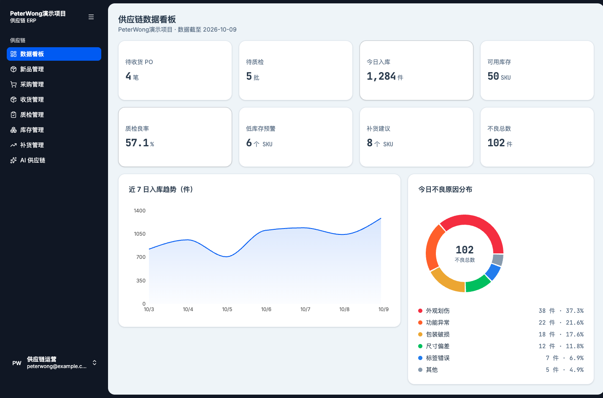
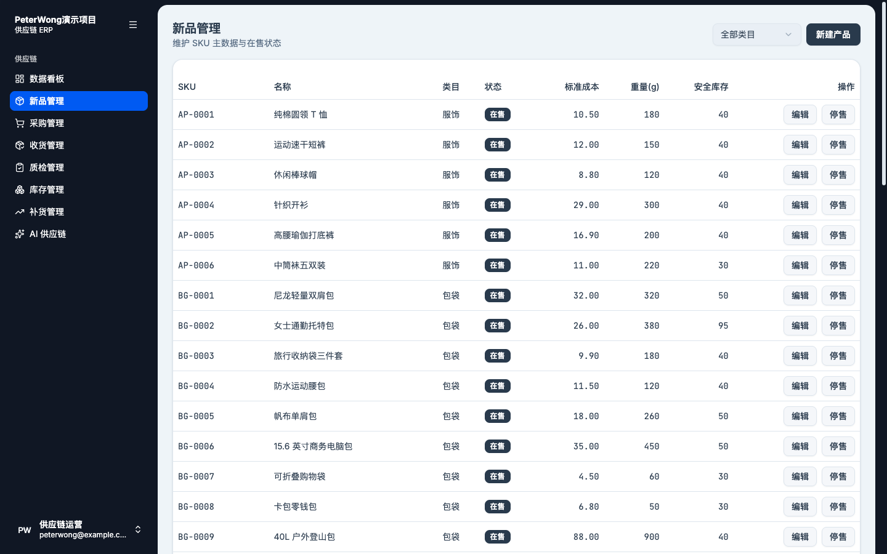
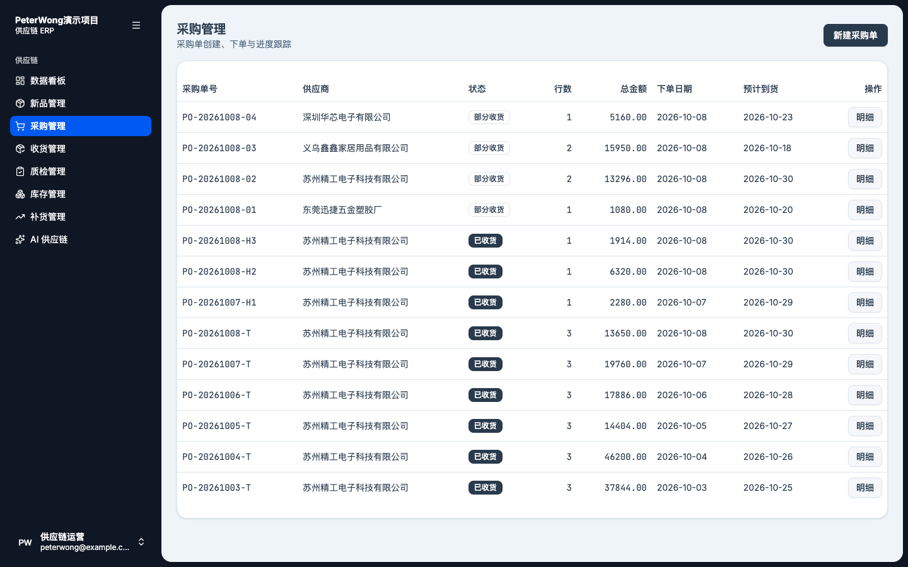
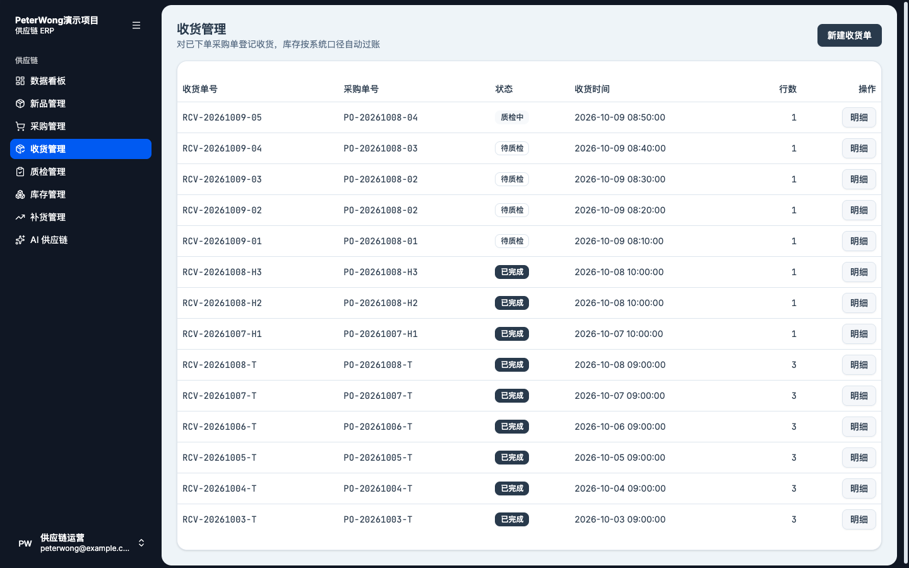
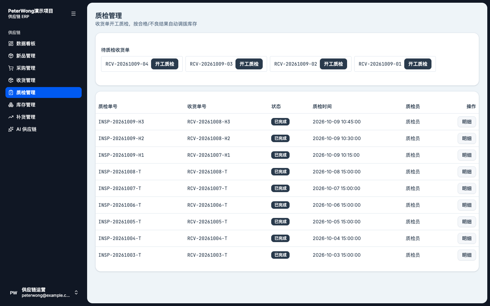
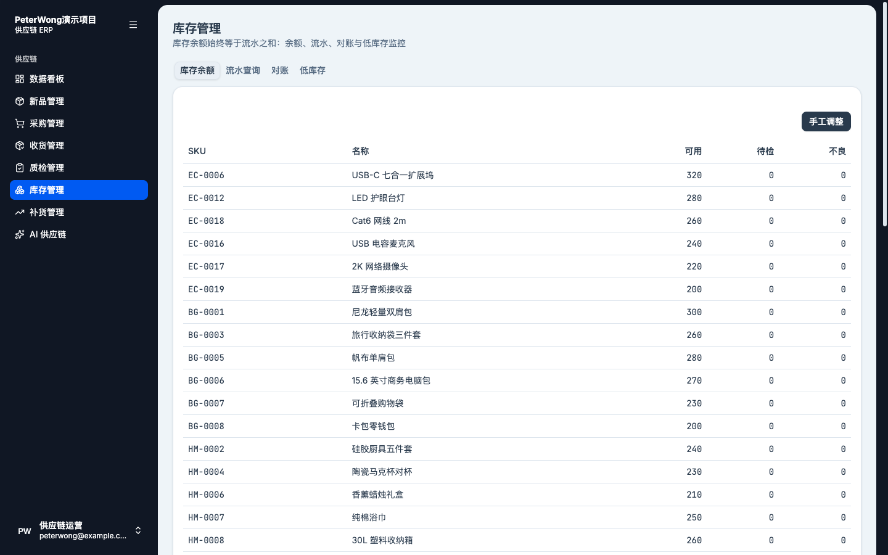
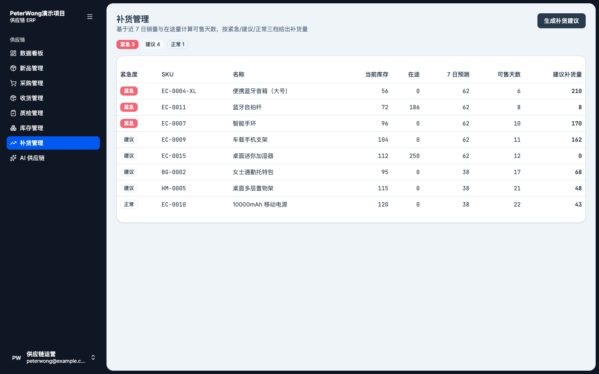

<div align="center">

# PeterWong 演示项目 · 跨境电商供应链 ERP

**一条命令启动 ｜ 数据可精确核对 ｜ 采购到入库全程可追溯 ｜ 参数驱动的补货规则引擎**

皮蛋王科技 · FDE（Forward Deployed Engineer）岗位面试作品 ｜ 数据锚点日：2026-10-09

`Python 3.12` · `FastAPI` · `React 19` · `TypeScript` · `SQLAlchemy` · `SQLite` · `Docker`

**[中文](#-中文) ｜ [English](#-english)**

</div>

---

# 🇨🇳 中文

## 📌 项目简介

一个面向**跨境电商小商品卖家**的供应链 ERP 演示系统。系统覆盖从采购下单（PO）、收货、质检到库存上架的**完整业务闭环**，每一笔库存变动都可溯源到原始单据；同时自动识别低库存 SKU，输出**紧急 / 建议 / 正常**三态补货建议。

全部业务指标由一份**确定性、幂等**的种子数据集生成，可通过核对脚本逐项精确验证——不是"我这儿看着没问题"，而是可复现、可校验的工程交付。

## ✨ 核心特性

- **完整业务闭环**：采购 → 收货 → 质检 → 库存，状态机驱动，流程清晰可追溯。
- **逐笔可溯源**：每一笔库存变动都写入流水，可溯源到原始单据与责任人。
- **库存恒等对账**：任意时刻可验证「每个 SKU 余额 = 其全部流水之和」。
- **参数驱动的补货引擎**：阈值全部来自系统设置表，在线可调、结果可解释，无黑盒。
- **确定性数据**：种子幂等，连跑两次结果完全一致；`make check` 8 项指标逐项断言。
- **一键启动**：`make up` 或 Docker Compose，两条路径开箱即用。

## 🖼️ 功能截图

### 1. 数据看板
> 8 项关键指标一屏总览，近 7 日入库趋势与不良原因分布实时呈现，数字与 `make check` 完全一致。



### 2. 新品管理
> 维护 SKU 主数据与在售状态，支持类目筛选、新建 / 编辑 / 停售。



### 3. 采购管理
> 采购单创建、下单与进度跟踪，状态机覆盖草稿 → 已下单 → 部分收货 → 已收货。



### 4. 收货管理
> 对已下单采购单登记收货、录入实收数量，库存按系统口径自动过账。



### 5. 质检管理
> 收货单开工质检，按合格 / 不良结果自动调拨库存并记录不良原因。



### 6. 库存管理
> 库存余额、流水查询、对账与低库存监控四位一体；支持带原因的手工调整。



### 7. 补货管理
> 基于近 7 日销量与在途量计算可售天数，按紧急 / 建议 / 正常三档给出建议补货量。



## 🚀 快速开始

### 方式 A：一条命令（推荐，无需 Docker）

```bash
make up
```

自动完成：安装依赖（uv + pnpm）→ 空库时播种 → 并行启动 API 与 Web。

- 前端：http://localhost:5173
- 后端 API：http://localhost:8000（交互式文档 `/docs`）

> 环境要求：Python ≥ 3.12（[uv](https://docs.astral.sh/uv/)）、Node + [pnpm](https://pnpm.io/)。

### 方式 B：Docker Compose

```bash
docker compose up --build
```

### 手动分步

```bash
uv sync                                               # 安装后端依赖
cd apps/web && pnpm install                           # 安装前端依赖
(cd apps/api && uv run python -m app.seeds.ensure_seed) # 空库才播种（非破坏、幂等）
make dev                                              # 同时启动前后端
```

### 核对演示数据（硬门禁）

```bash
make check     # 8 项指标逐项断言，任一不符则退出码非 0
```

## 📊 8 项关键指标（验收真值表）

`make check` 与看板页面展示的数字完全一致：

| # | 指标 | 目标值 |
| --- | --- | --- |
| 1 | 待收货采购单 | **4 笔** |
| 2 | 待质检批次 | **5 批** |
| 3 | 今日入库 | **1,284 件** |
| 4 | 可用库存 | **50 SKU** |
| 5 | 质检良率 | **57.1%** |
| 6 | 低库存预警 | **6 个 SKU** |
| 7 | 补货建议 | **8 个 SKU**（3 紧急 / 4 建议 / 1 正常） |
| 8 | 不良总数 | **102 件** |

不良原因分布：外观划伤 37% / 功能异常 22% / 包装破损 18% / 尺寸偏差 12% / 标签错误 7% / 其他 5%。

## 🔄 业务闭环（核心演示路径）

```
 采购下单 PO            收货                质检                 库存
 ┌─────────┐      ┌──────────┐      ┌──────────┐       ┌──────────────┐
 │ 草稿     │ ───▶ │ 录入实收  │ ───▶ │ 合格/不良  │ ───▶  │ available    │
 │ → 已下单 │      │ pending  │      │ +原因分布 │       │ defective    │
 └─────────┘      └──────────┘      └──────────┘       └──────────────┘
   place          recv_inbound       qc_pass/qc_fail      每步一条流水
```

1. **采购**：选供应商、多行选 SKU / 数量 / 单价 → 下单（状态机：草稿 → 已下单 → 部分收货 → 已收货 / 已取消）。
2. **收货**：对已下单 PO 创建收货单并录入实收数量，货物进入待检（pending）库存，写 `recv_inbound` 流水。
3. **质检**：一页录入合格 / 不良数量与不良原因；合格转 `available`（`qc_pass`），不良转 `defective`（`qc_fail` + `defect_records`）。
4. **库存台账**：任意时刻可用「对账接口」验证 **每个 SKU 余额 = 其全部流水之和**；支持按 SKU / 单据号过滤流水、带原因的手工调整（`manual_adjust`）。

> 「今日入库」支持两种口径（系统设置 `inbound_caliber`）：`receiving`（收货即入库，默认）与 `inspection`（质检合格才入库）。

## 🧠 补货规则引擎（"AI" 参数驱动）

不硬编码、无黑盒：所有阈值来自系统设置表，可通过 `GET / PUT /api/settings` 在线调整。

| 参数 | 默认值 | 含义 |
| --- | --- | --- |
| `low_stock_days_threshold` | 14 | 可售天数低于此值 → 低库存预警 |
| `urgency_emergency_days` | 10 | 可售天数 ≤ 此值 → **紧急** |
| `urgency_suggestion_days` | 21 | 可售天数 ≤ 此值 → **建议**；其余 → 正常 |

计算逻辑（确定性）：

- **日均销量** = 近 7 日 DailySales 均值；**7 日预测** = 日均销量 × 7
- **可售天数** = 现有可用库存 ÷ 日均销量
- **目标库存** = round(日均销量 × 目标覆盖天数 30)（业务常量 `TARGET_COVER_DAYS`）
- **建议量** = max(0, 目标库存 − 现有库存 − 在途量)（在途量由未交 PO 行实时算出，不落字段）
- 三态紧急度：可售天数 `≤ emergency` → 紧急；`≤ suggest` → 建议；否则正常

结果：**低库存 6 SKU、补货建议 8 SKU（3 紧急 / 4 建议 / 1 正常）**。

## 🏗️ 系统架构

```
┌──────────────────────────────────────────────────────────────┐
│                      Browser (React SPA)                      │
│  Vite · TanStack Router/Query · shadcn/ui (Radix+Tailwind)    │
│  Recharts                                  :5173              │
└──────────────────────────────┬───────────────────────────────┘
                                │  REST / JSON
┌──────────────────────────────┼───────────────────────────────┐
│                        FastAPI  :8000                          │
│  routers (薄)  ──▶  services (业务/规则)  ──▶  SQLAlchemy ORM   │
│  dashboard · products · purchase_orders · receiving ·          │
│  inspection · inventory · replenishment · settings · suppliers │
└──────────────────────────────┬───────────────────────────────┘
                                │
                      ┌─────────▼─────────┐
                      │   SQLite (14 表)   │
                      └───────────────────┘
        apps/mcp-server（最小库存查询 tool · 下一里程碑）
```

**设计约定**：routers 保持轻薄，业务行为收敛到 services；请求 / 响应 / 更新 schema 分离；库存过账统一走 `services/inventory_ledger.py`（原子条件 UPDATE + 余额重建 + 对账）。

## 🧰 技术栈

| 层 | 技术 |
| --- | --- |
| 后端 | Python 3.12 · FastAPI · SQLAlchemy 2 · Pydantic v2 · SQLite |
| 前端 | React 19 · TypeScript · Vite · TanStack Router/Query · shadcn/ui · Recharts |
| 工程 | uv workspace monorepo · pnpm · ruff · pytest · Docker Compose · CI |
| 测试 | pytest 关键路径（种子幂等、状态流转、库存对账、补货三态）；前端 Vitest |

## 📁 项目结构

```
apps/
  api/app/
    main.py            # FastAPI 应用工厂
    config.py          # Pydantic 设置（锚点日、CORS、DB）
    models/            # 14 个 ORM 模型 + 枚举
    schemas/           # 请求 / 响应模型
    routers/           # HTTP 端点（轻薄）
    services/          # 业务与规则引擎
    seeds/             # run_seed(破坏式) / ensure_seed(非破坏) / check(核对)
  web/src/
    routes/            # TanStack 文件路由
    features/          # 7 个业务模块（+ errors）
  mcp-server/          # MCP 最小 tool（下一里程碑）
docs/
  screenshots/         # README 功能截图
  PRD.md               # 需求文档
  demo-script.md       # 10 分钟演示话术
Makefile  docker-compose.yml  pyproject.toml
```

## 🎯 FDE 能力映射

| FDE 核心能力 | 作品中的证据 |
| --- | --- |
| 数据建模 + 可验证目标 | 14 张表、确定性种子、`make check` 8 项数字精确核对 |
| 深入业务闭环 + 可追溯 | 采购 → 收货 → 质检 → 库存，每笔变动溯源到单据 |
| 用规则 / 参数快速交付"智能" | 补货建议由系统设置参数驱动、三态紧急度，阈值在线可调 |
| 一键部署 + 清晰沟通 | `make up` / Docker 两条路径、README + 10 分钟演示脚本 |
| 工程质量 | 库存余额恒等对账、幂等播种、关键路径自动化测试 |

## 🗺️ 下一里程碑（可扩展点）

- **MCP Server**：暴露库存查询 tool，打通 AI Agent 与业务系统（骨架已建）。
- **LLM 分析层**：对补货建议 / 质检异常做自然语言归因（架构已预留，不影响确定性主干）。
- 补货建议「一键生成 PO」、ML 销量预测替换均值模型。

---
---

# 🇺🇸 English

## 📌 Overview

A supply-chain ERP demo for **cross-border e-commerce small-goods sellers**. It covers the **full operational loop** from purchase order (PO), receiving, and quality inspection to stock put-away; every inventory movement is traceable to its source document. The system automatically detects low-stock SKUs and produces **three-tier** replenishment advice: Emergency / Suggested / Normal.

All metrics are generated from a **deterministic, idempotent** seed dataset and verified item-by-item by a check script—delivering reproducible, verifiable engineering rather than "works on my machine."

## ✨ Key Features

- **Full operational loop**: Purchase → Receiving → Inspection → Inventory, driven by state machines.
- **Full traceability**: every stock movement is logged and traceable to its source document and owner.
- **Inventory identity reconciliation**: at any time, "balance per SKU = sum of all its transactions" can be verified.
- **Parameter-driven replenishment engine**: thresholds come from the settings table, adjustable online, fully explainable—no black box.
- **Deterministic data**: idempotent seeding yields identical results across runs; `make check` asserts 8 metrics.
- **One-command startup**: `make up` or Docker Compose, both work out of the box.

## 🖼️ Feature Screenshots

### 1. Dashboard
> All 8 key metrics at a glance, with the 7-day inbound trend and defect-reason breakdown; numbers match `make check` exactly.


### 2. Products
> Maintain SKU master data and on-sale status, with category filtering and create / edit / discontinue.


### 3. Purchase Orders
> Create, place, and track purchase orders; the state machine spans Draft → Placed → Partially Received → Received.


### 4. Receiving
> Register receipts against placed POs, enter received quantities, and auto-post stock under the system caliber.


### 5. Inspection
> Start inspection on received orders; pass/fail results auto-transfer stock and record defect reasons.


### 6. Inventory
> Balances, transaction lookup, reconciliation, and low-stock monitoring in one place, with reason-based manual adjustments.


### 7. Replenishment
> Compute days-of-supply from 7-day sales and on-order quantities, then suggest quantities across Emergency / Suggested / Normal.


## 🚀 Quick Start

### Option A: One command (recommended, no Docker)

```bash
make up
```

Automatically: installs dependencies (uv + pnpm) → seeds an empty database → starts API and Web in parallel.

- Frontend: http://localhost:5173
- Backend API: http://localhost:8000 (interactive docs at `/docs`)

> Requirements: Python ≥ 3.12 ([uv](https://docs.astral.sh/uv/)), Node + [pnpm](https://pnpm.io/).

### Option B: Docker Compose

```bash
docker compose up --build
```

### Manual steps

```bash
uv sync                                               # install backend dependencies
cd apps/web && pnpm install                           # install frontend dependencies
(cd apps/api && uv run python -m app.seeds.ensure_seed) # seed only if empty (safe, idempotent)
make dev                                              # start frontend and backend
```

### Verify demo data (hard gate)

```bash
make check     # asserts 8 metrics one by one; non-zero exit on any mismatch
```

## 📊 8 Key Metrics (Acceptance Truth Table)

`make check` and the dashboard show identical numbers:

| # | Metric | Target |
| --- | --- | --- |
| 1 | POs awaiting receipt | **4** |
| 2 | Batches awaiting inspection | **5** |
| 3 | Today's inbound | **1,284 units** |
| 4 | Available stock | **50 SKUs** |
| 5 | Inspection pass rate | **57.1%** |
| 6 | Low-stock alerts | **6 SKUs** |
| 7 | Replenishment suggestions | **8 SKUs** (3 Emergency / 4 Suggested / 1 Normal) |
| 8 | Total defects | **102 units** |

Defect-reason distribution: Cosmetic scratch 37% / Functional fault 22% / Packaging damage 18% / Size deviation 12% / Labeling error 7% / Other 5%.

## 🔄 Operational Loop (Core Demo Path)

```
 Purchase PO           Receiving           Inspection            Inventory
 ┌─────────┐      ┌──────────┐      ┌──────────┐       ┌──────────────┐
 │ Draft    │ ───▶ │ Enter     │ ───▶ │ Pass/     │ ───▶  │ available    │
 │ → Placed │      │ received  │      │ Fail +    │       │ defective    │
 └─────────┘      └──────────┘      │ reasons   │       └──────────────┘
   place          recv_inbound       └──────────┘        one transaction
                                     qc_pass/qc_fail      per step
```

1. **Purchase**: pick a supplier, add SKU/qty/price lines → place (Draft → Placed → Partially Received → Received / Cancelled).
2. **Receiving**: create a receipt against a placed PO, enter received quantities; goods enter pending stock with a `recv_inbound` transaction.
3. **Inspection**: enter pass/fail quantities and defect reasons in one page; pass → `available` (`qc_pass`), fail → `defective` (`qc_fail` + `defect_records`).
4. **Inventory ledger**: the reconciliation API verifies **balance per SKU = sum of all its transactions**; filter transactions by SKU/document and make reason-based manual adjustments (`manual_adjust`).

> "Today's inbound" supports two calibers (system setting `inbound_caliber`): `receiving` (count on receipt, default) and `inspection` (count only passed QC).

## 🧠 Replenishment Rule Engine (Parameter-Driven "AI")

No hardcoding, no black box: every threshold comes from the settings table and is adjustable online via `GET / PUT /api/settings`.

| Parameter | Default | Meaning |
| --- | --- | --- |
| `low_stock_days_threshold` | 14 | Days-of-supply below this → low-stock alert |
| `urgency_emergency_days` | 10 | Days-of-supply ≤ this → **Emergency** |
| `urgency_suggestion_days` | 21 | Days-of-supply ≤ this → **Suggested**; otherwise Normal |

Deterministic computation:

- **Avg daily sales** = mean of last 7 DailySales records; **7-day forecast** = avg daily sales × 7
- **Days of supply** = current available stock ÷ avg daily sales
- **Target stock** = round(avg daily sales × 30-day target cover) (constant `TARGET_COVER_DAYS`)
- **Suggested qty** = max(0, target − current stock − on-order) (on-order computed live from open PO lines, not stored)
- Three-tier urgency: days-of-supply `≤ emergency` → Emergency; `≤ suggest` → Suggested; otherwise Normal

Result: **6 low-stock SKUs, 8 replenishment suggestions (3 Emergency / 4 Suggested / 1 Normal)**.

## 🏗️ System Architecture

```
┌──────────────────────────────────────────────────────────────┐
│                      Browser (React SPA)                      │
│  Vite · TanStack Router/Query · shadcn/ui (Radix+Tailwind)    │
│  Recharts                                  :5173              │
└──────────────────────────────┬───────────────────────────────┘
                                │  REST / JSON
┌──────────────────────────────┼───────────────────────────────┐
│                        FastAPI  :8000                          │
│  routers (thin) ──▶ services (business/rules) ──▶ SQLAlchemy   │
│  dashboard · products · purchase_orders · receiving ·          │
│  inspection · inventory · replenishment · settings · suppliers │
└──────────────────────────────┬───────────────────────────────┘
                                │
                      ┌─────────▼─────────┐
                      │  SQLite (14 tables)│
                      └───────────────────┘
        apps/mcp-server (minimal stock-query tool · next milestone)
```

**Design conventions**: routers stay thin, business behavior lives in services; request/response/update schemas are separated; inventory posting goes through `services/inventory_ledger.py` (atomic conditional UPDATE + balance rebuild + reconciliation).

## 🧰 Tech Stack

| Layer | Technologies |
| --- | --- |
| Backend | Python 3.12 · FastAPI · SQLAlchemy 2 · Pydantic v2 · SQLite |
| Frontend | React 19 · TypeScript · Vite · TanStack Router/Query · shadcn/ui · Recharts |
| Engineering | uv workspace monorepo · pnpm · ruff · pytest · Docker Compose · CI |
| Testing | pytest critical paths (seed idempotency, state transitions, inventory reconciliation, replenishment tiers); Vitest on the frontend |

## 📁 Project Structure

```
apps/
  api/app/
    main.py            # FastAPI app factory
    config.py          # Pydantic settings (anchor date, CORS, DB)
    models/            # 14 ORM models + enums
    schemas/           # request/response models
    routers/           # HTTP endpoints (thin)
    services/          # business and rule engines
    seeds/             # run_seed(destructive) / ensure_seed(safe) / check
  web/src/
    routes/            # TanStack file-based routing
    features/          # 7 business modules (+ errors)
  mcp-server/          # minimal MCP tool (next milestone)
docs/
  screenshots/         # README feature screenshots
  PRD.md               # requirements doc
  demo-script.md       # 10-minute demo script
Makefile  docker-compose.yml  pyproject.toml
```

## 🎯 FDE Capability Mapping

| FDE Capability | Evidence in This Project |
| --- | --- |
| Data modeling + verifiable goals | 14 tables, deterministic seeds, exact verification of 8 metrics via `make check` |
| Deep business loop + traceability | Purchase → Receiving → Inspection → Inventory, every movement traceable |
| Delivering "intelligence" via rules/parameters | Parameter-driven suggestions, three-tier urgency, thresholds adjustable online |
| One-command deploy + clear communication | `make up` / Docker paths, README + 10-minute demo script |
| Engineering quality | Inventory identity reconciliation, idempotent seeding, automated critical-path tests |

## 🗺️ Next Milestones

- **MCP Server**: expose a stock-query tool to connect AI agents with the business system (skeleton in place).
- **LLM analysis layer**: natural-language attribution for replenishment suggestions / QC anomalies (architecture reserved; deterministic core unaffected).
- "One-click PO generation" from suggestions; ML sales forecasting replacing the moving-average model.
